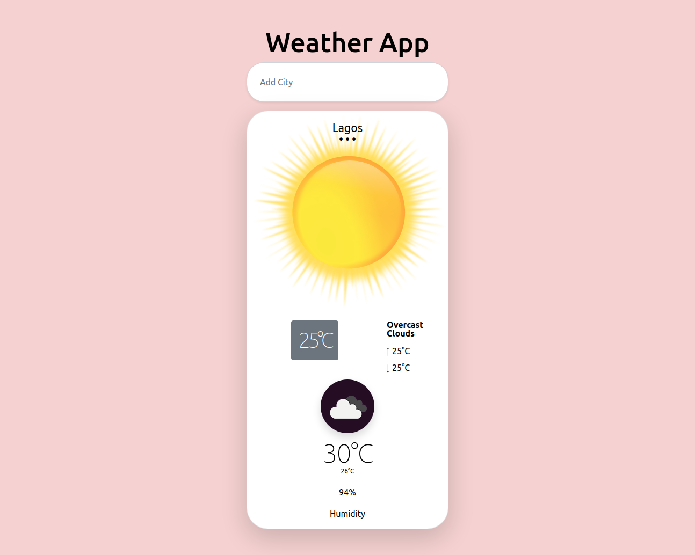

# weather-app
A simple weather app that extracts information from the openweathermap.org/api thereby enabling users accurately forecast weather conditions in different cities. This app was built with Javascript and Webpack with emphasis on the async/await concept.




## Built With
- JavaScript
- Webpack
- OpenWeatherMap API
- Bootstrap v5.1.0
- HTML5
- CSS3

## Live Demo
- [Live Demo Link](https://rawcdn.githack.com/JulianaOsemeke/weather-app/b800034198260801fb06343ddeb1bda5993d6beb/dist/index.html)

## Getting Started

**simple steps set up on your local machine**

```
- $ git clone `$ git clone git@github.com:JulianaOsemeke/weather-app.git`
- $ `cd weather-app`
- $ npm install

```

## Author

👤 **Juliana Osemeke**

- GitHub: [@JulianaOsemeke](https://github.com/JulianaOsemeke)
- LinkedIn: [@juliana-osemeke](https://www.linkedin.com/in/juliana-osemeke/)
- Twitter: [@JulianaOsemeke](https://twitter.com/JulianaOsemeke)

## 🤝 Contributing

Contributions, issues, and feature requests are welcome!

Feel free to check the [issues page](issues/).


## Show your support

Give a ⭐️ if you like this project!

## Acknowledgment

- Microverse
- The Odin Project

## 📝 License

This project is [MIT](./LICENSE) licensed.
